# KOSMOS Software Architecture

```mermaid
graph LR
    %% External Systems
    KSP[Kerbal Space Program]
    kRPC[kRPC Mod]
    OpenAI[OpenAI API]
    
    %% Main Loop Flow
    subgraph "KOSMOS Execution Loop"
        direction TB
        
        %% Telemetry Collection
        TelemetryCollector[📊 Telemetry Collector]
        
        %% Agent Communication Loop
        subgraph "Agent Communication Loop"
            direction LR
            MissionControl[🎯 Mission Control<br/>Plans next mission]
            FlightAgent[🚀 Flight Agent<br/>Generates & executes code]
            AuditAgent[🔍 Audit Agent<br/>Monitors progress]
        end
        
        %% Environment Bridge
        KSPEnv[🌉 KSP Environment<br/>Bridge to KSP]
        
        %% Data Storage
        VectorDB[💾 Vector Database<br/>Skills & QA Cache]
        Checkpoint[💾 Checkpoint System<br/>Mission State]
    end
    
    %% External Connections
    KSPEnv --> kRPC
    kRPC --> KSP
    
    %% Data Flow - Telemetry Loop
    KSPEnv --> TelemetryCollector
    TelemetryCollector --> MissionControl
    TelemetryCollector --> FlightAgent
    TelemetryCollector --> AuditAgent
    
    %% Agent Communication Loop
    MissionControl -->|"1. Propose Mission"| FlightAgent
    FlightAgent -->|"2. Execute Code"| KSPEnv
    KSPEnv -->|"3. Get Results"| AuditAgent
    AuditAgent -->|"4. Provide Feedback"| MissionControl
    
    %% AI Processing
    MissionControl --> OpenAI
    FlightAgent --> OpenAI
    AuditAgent --> OpenAI
    
    %% Data Persistence
    MissionControl --> VectorDB
    FlightAgent --> Checkpoint
    AuditAgent --> VectorDB
    
    %% Control Flow
    FlightAgent -->|"Time-sliced execution<br/>2-3 second loops"| KSPEnv
    AuditAgent -->|"Real-time monitoring<br/>Intervention capability"| FlightAgent
    
    %% Styling
    classDef external fill:#e1f5fe,stroke:#01579b,stroke-width:3px
    classDef telemetry fill:#fff3e0,stroke:#e65100,stroke-width:2px
    classDef agent fill:#e8f5e8,stroke:#1b5e20,stroke-width:2px
    classDef bridge fill:#f3e5f5,stroke:#4a148c,stroke-width:2px
    classDef storage fill:#fce4ec,stroke:#880e4f,stroke-width:2px
    
    class KSP,kRPC,OpenAI external
    class TelemetryCollector telemetry
    class MissionControl,FlightAgent,AuditAgent agent
    class KSPEnv bridge
    class VectorDB,Checkpoint storage
```

## Architecture Overview

### Core Components

1. **Kosmos (Main Orchestrator)**
   - Central coordination hub
   - Manages agent lifecycle
   - Handles mission execution flow
   - Coordinates between all agents

2. **Environment Layer**
   - **KSPEnv**: Bridge between KOSMOS and Kerbal Space Program
   - **TelemetryCollector**: Real-time data collection from KSP vessel

3. **AI Agent Layer**
   - **MissionControlAgent**: Plans missions and proposes next steps
   - **FlightAgent**: Generates and executes kRPC Python code
   - **AuditAgent**: Monitors progress and provides critiques
   - **ManeuverAgent**: Manages reusable maneuver library

4. **Control Primitives**
   - Executable functions for common operations
   - Context examples for AI training
   - Reusable code snippets

5. **Data Storage**
   - Checkpoint system for mission state
   - Vector database for QA caching and skills
   - Mission history tracking

### Data Flow

1. **Telemetry Collection**: `TelemetryCollector` → All Agents
2. **Mission Planning**: `MissionControlAgent` → `FlightAgent`
3. **Code Execution**: `FlightAgent` → `KSPEnv` → `kRPC` → `KSP`
4. **Progress Monitoring**: `AuditAgent` → `MissionControlAgent`
5. **Skill Learning**: `ManeuverAgent` → Vector Database

### Key Features

- **Time-sliced Execution**: Short loops for real-time responsiveness
- **Shared Control Bus**: Real-time communication between agents
- **Skill Library**: Persistent storage of successful maneuvers
- **Checkpoint System**: Mission state persistence
- **Multi-agent Coordination**: Specialized agents for different tasks
